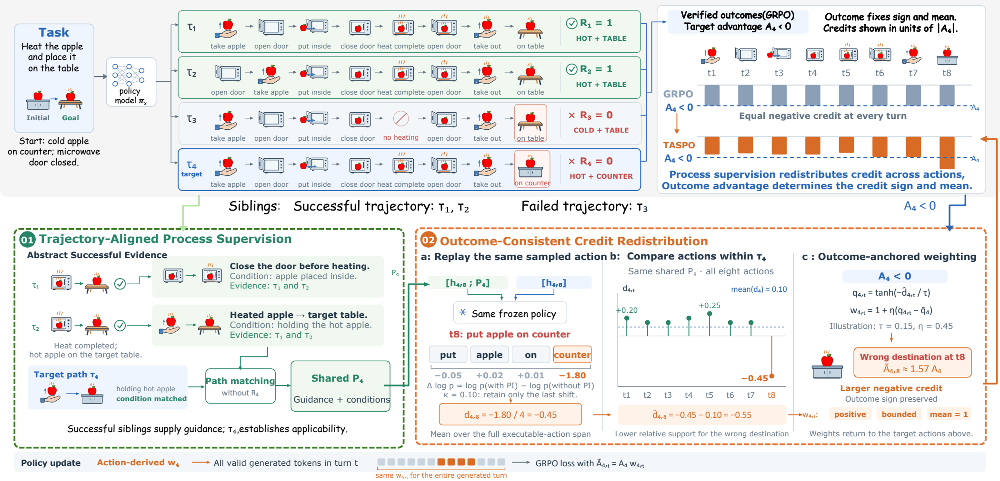

<p align="center">
  
</p>

<h2 align="center">TASPO：匿名评审代码</h2>

<p align="center">
  <a href="#实验结果"><b>实验结果</b></a> &nbsp; · &nbsp;
  <a href="#快速开始"><b>快速开始</b></a> &nbsp; · &nbsp;
  <a href="docs/usage.md"><b>使用文档</b></a> &nbsp; · &nbsp;
  <a href="README.md">English</a>
</p>

---

**TASPO** 将过程监督用于智能体强化学习中的信用分配。我们从同组的成功轨迹中提取指导，与目标轨迹实际经历的状态和动作对齐，再利用这些指导调整各个动作获得的优势值。

核心想法是：**由结果决定更新方向，由过程监督细化信用分配。** 一条失败轨迹里有用的动作可以受到更轻的惩罚；一条成功轨迹里获得更多指导支持的动作可以得到更强的正向更新。

- **与目标轨迹对齐。** 成功经验先经过筛选和对齐，再作为目标轨迹的指导。
- **以完整动作为单位。** 比较有、无指导时动作的似然，通过正值、有界、均值为一的权重重新分配原有优势。
- **复用已有交互。** 指导构建与重新评分在训练阶段完成，不增加环境交互；评估时只使用策略模型。

<p align="center">
  <a href="docs/assets/method.png"></a>
</p>

## 实验结果

在三个骨干模型上，TASPO 均提升了 GRPO 在 ALFWorld、Search-QA 和 WebShop 上的表现。使用 Qwen2.5-3B-Instruct 时，三个指标分别提升 **14.4、10.0 和 14.8 个百分点**。

| 骨干模型 | 方法 | ALFWorld ↑ | Search-QA ↑ | WebShop ↑ |
| :--- | :--- | ---: | ---: | ---: |
| Qwen2.5-3B-Instruct | GRPO | 71.8 | 36.4 | 63.3 |
| | **TASPO** | **86.2** | **46.4** | **78.1** |
| Qwen2.5-7B-Instruct | GRPO | 77.0 | 48.1 | 75.0 |
| | **TASPO** | **90.1** | **49.8** | **76.4** |
| Qwen3-1.7B-Instruct | GRPO | 40.1 | 43.6 | 43.0 |
| | **TASPO** | **69.6** | **46.6** | **67.1** |

结果单位为百分比。ALFWorld 为任务类别宏平均成功率，Search-QA 为数据集宏平均精确匹配准确率，WebShop 为成功率。更多基线和 WebShop 分数见[完整结果](docs/results.md)。

## 快速开始

建议从 ALFWorld 开始。默认使用 Linux、Conda、Python 3.12、4 张 NVIDIA GPU 和 Qwen2.5-3B-Instruct。以下命令均在仓库根目录执行。

```bash
conda create -n taspo python=3.12 -y
conda activate taspo
bash scripts/taspo/bootstrap_env.sh alfworld
```

配置训练时使用的 Analyzer。它需要提供兼容 OpenAI Chat Completions 的接口：

```bash
export TASPO_ANALYZER_BASE_URL="https://your-endpoint/v1/chat/completions"
export TASPO_ANALYZER_MODEL="your-analyzer-model"
export TASPO_ANALYZER_API_KEY="your-api-key"
export TASPO_ANALYZER_REQUIRED=true
```

本地服务如果不需要认证，可以不设置 API key。`TASPO_ANALYZER_REQUIRED=true` 会在 Analyzer 请求失败时停止训练。

```bash
export CUDA_VISIBLE_DEVICES=0,1,2,3

# 检查环境与 Analyzer 连接。
python -m scripts.taspo.preflight --benchmark alfworld --check-api

# 先运行两步冒烟测试，再开始训练。
bash examples/taspo/smoke_alfworld.sh
bash examples/taspo/run_alfworld_3b.sh
```

Search-QA 需要额外启动检索服务，WebShop 使用独立的 Python 3.10 环境。安装步骤见[环境配置](docs/installation.md)，参数覆盖、断点续训、基线和评估见[训练指南](docs/usage.md)。

## 代码入口

TASPO 的核心实现位于 [`agent_system/taspo/`](agent_system/taspo)：`analyzer.py` 构建并对齐指导，`action_mask.py` 定位可执行动作，`teacher.py` 构造带指导的评分输入，`credit.py` 完成优势重分配。训练入口为 [`main_taspo.py`](verl/trainer/main_taspo.py)。

```bash
bash scripts/taspo/run_unit_tests.sh
```

## 致谢与许可证

本项目基于 [verl](https://github.com/volcengine/verl)、[verl-agent](https://github.com/langfengQ/verl-agent) 和 [SDAR](https://github.com/ZJU-REAL/SDAR) 构建。感谢这些项目，以及 ALFWorld、Search-R1、WebShop 和 SkyRL 的作者开放代码与环境。

TASPO 采用 [Apache-2.0](LICENSE) 许可证。第三方代码保留原有许可证与版权声明，详见 [NOTICE](NOTICE)。贡献方式见 [CONTRIBUTING.md](CONTRIBUTING.md)。
